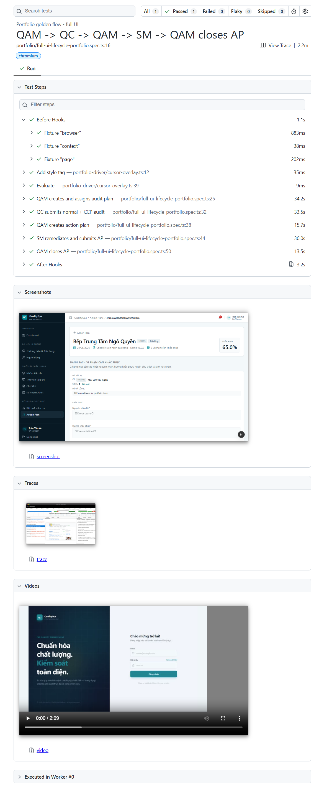
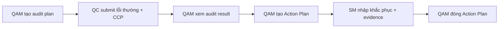

# QualityOps QA/QC Platform

Nền tảng QA/QC theo vai trò, dùng để quản lý kế hoạch audit, bài kiểm tra cửa hàng, kết quả chấm, Action Plan khắc phục, dashboard vận hành và kiểm thử E2E toàn luồng.

**Stack:** `Next.js 16` · `React 19` · `TypeScript` · `TanStack Query` · `Tailwind CSS` · `Playwright E2E` · `RBAC`

## Demo 90 Giây

Demo portfolio đi qua full lifecycle nghiệp vụ:

`QAM tạo audit plan -> QC chấm lỗi -> QAM xem kết quả -> QAM tạo Action Plan -> SM khắc phục -> QAM đóng Action Plan`

[Xem video demo full flow](./docs/portfolio/assets/qaqc-full-flow-demo.webm)

## Bằng Chứng E2E



Video demo được tạo từ Playwright UI flow thật, không phải mock thủ công. Report thể hiện từng checkpoint của lifecycle, screenshot, trace và video evidence.

## Bài Toán

Đội QA/QC chuỗi cửa hàng cần một hệ thống để lập kế hoạch audit, phân công người chấm, ghi nhận lỗi tại cửa hàng, theo dõi hành động khắc phục và xem chất lượng vận hành theo từng vai trò.

QualityOps mô hình hóa luồng đó thành một sản phẩm multi-role:

- **QAM** tạo kế hoạch audit, theo dõi tiến độ, xem kết quả và đóng Action Plan.
- **QC** thực hiện bài audit được giao và submit lỗi kèm evidence.
- **SM** xem lỗi của cửa hàng, nhập nguyên nhân, hướng khắc phục và minh chứng.
- **AM** theo dõi chất lượng cửa hàng trong phạm vi phụ trách.
- **Admin** quản lý dữ liệu hệ thống, người dùng và phân quyền.

## Luồng Nghiệp Vụ Chính



## Trải Nghiệm Theo Vai Trò

| Vai trò | Trách nhiệm chính |
|---|---|
| Admin | Quản lý user, master data, RBAC và dashboard tổng quan hệ thống |
| QAM | Quản lý audit plan, xem audit result, tạo và đóng Action Plan |
| QC | Chấm các assignment được giao và submit findings |
| SM | Khắc phục lỗi cửa hàng bằng root cause, remediation, hạn xử lý, người phụ trách và evidence |
| AM | Theo dõi chất lượng và Action Plan trong phạm vi cửa hàng phụ trách |

## Điểm Nổi Bật

- Dashboard theo vai trò: Admin, QAM, QC, SM, AM
- Tạo audit plan và phân công store cho QC
- QC audit execution với lỗi thường và CCP
- Review audit result bằng `auditId`
- Action Plan lifecycle: draft, submitted, rejected, closed
- SM remediation form với root cause, remediation, fixed date, assignee và evidence
- UI theo trạng thái và RBAC-scoped navigation
- Table search, filter, sort theo từng column
- Mobile table/card responsive layout
- FE reverse proxy cho `/api` và `/uploads`
- Portfolio E2E bằng Playwright cho full QA/QC lifecycle

## Kiến Trúc Kỹ Thuật

| Lớp | Công nghệ |
|---|---|
| Frontend | Next.js App Router, React 19, TypeScript |
| Data fetching | TanStack Query |
| Styling | Tailwind CSS, shadcn-style components, Base UI |
| Form | React Hook Form, Zod |
| API integration | Relative `/api` client với FE proxy |
| Testing | Vitest, Playwright |
| E2E artifacts | Video, screenshot, HTML report, trace |

Frontend gọi backend bằng relative URL như `/api/...` và `/uploads/...`, giúp browser/mobile chỉ thấy FE origin thay vì gọi trực tiếp backend port.

## Chiến Lược Test

| Tầng test | Mục đích |
|---|---|
| Unit tests | Kiểm tra frontend logic và API helpers |
| Preflight E2E | Kiểm tra FE/BE reachable, role login và seed readiness |
| Regression E2E | Bảo vệ các bug quan trọng như auditId navigation và Action Plan validation |
| RBAC smoke | Kiểm tra scope truy cập theo role |
| Portfolio E2E | Chạy full lifecycle hiển thị được để làm demo evidence |

Các lệnh kiểm tra thường dùng:

```powershell
npm.cmd run test
npm.cmd run check
npm.cmd run test:e2e:preflight
npm.cmd run test:e2e:regression
```

Chạy portfolio demo capture:

```powershell
$env:E2E_ALLOW_MUTATION="true"
$env:E2E_PORTFOLIO_CAPTURE="true"
$env:E2E_SLOW_MO="120"
$env:E2E_DEMO_PAUSE_MS="400"
npm.cmd run test:e2e:portfolio
```

## Demo Accounts

Demo accounts được cấu hình trong môi trường seed demo. E2E local dùng các role account được quản lý trong test helpers và backend seed data.

## Chạy Local

```powershell
npm install
npm.cmd run dev
```

Kiểm tra build/test:

```powershell
npm.cmd run check
npm.cmd run test
```

Chạy E2E preflight:

```powershell
npm.cmd run test:e2e:preflight
```

> E2E local yêu cầu backend API và seeded demo database đang chạy.

## Ghi Chú Portfolio

- Video demo được tạo từ Playwright UI flow thật.
- Ảnh Playwright report được commit như evidence nhẹ.
- Full Playwright report, trace và raw test output được ignore khỏi git.
- Repo chỉ commit video demo nhỏ và ảnh report cần cho README.

Xem thêm [docs/portfolio-demo-guide.md](./docs/portfolio-demo-guide.md) để tạo lại video/report demo.
