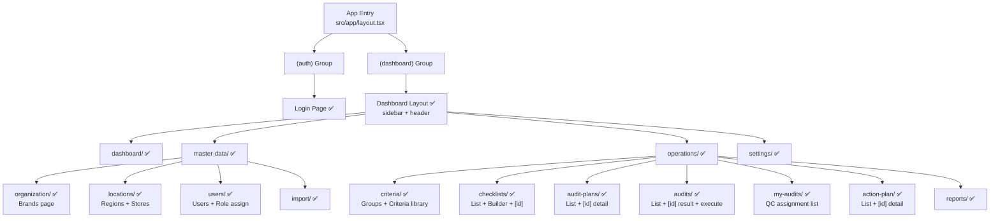

# Visual Explanation: Tiến Độ Dự Án QA/QC Frontend

## Overview

Dự án frontend số hóa quy trình audit chất lượng cửa hàng MayCha. Kiến trúc Vertical Slice — 7 slices, mỗi slice = 1 user flow hoàn chỉnh.

---

## Quick View (ASCII)

```
BUILD PLAN — 7 Slices Progress
══════════════════════════════════════════════════════════

  Micro 0 │ Testing Infra    │ ⚠️  Partial  │ Vitest setup, ít test thực
  Slice 1 │ Auth Shell        │ ✅ Done      │ Login, Dashboard, Me hook
  Slice 2 │ CA Master Data    │ ✅ Done      │ Brands, Stores, Users, Roles
  Slice 3 │ QAM Criteria+CL   │ ✅ Done      │ Groups, Criteria, Checklist Builder
  Slice 4 │ QAM Audit Plans   │ ✅ Done      │ Plan list + Create wizard
  Slice 5 │ QC Execute Audit  │ ✅ Done      │ My Audits, Execute page (mobile)
  Slice 6 │ Post-Audit        │ ✅ Done      │ Results, Action Plans CRUD
  Slice 7 │ Dashboard/Reports │ ✅ Done      │ Per-role dashboards + Reports

══════════════════════════════════════════════════════════
Overall UI Scaffold: ~90% ✅  |  API Wiring: ~70% 🔄
Tests: ~30% ⚠️              |  E2E: pending ❌
```

---

## Detailed Flow — Toàn Bộ Cấu Trúc



---

## Feature Coverage Matrix

```
FEATURE                  │ API    │ Hooks  │ UI     │ Tests  │ E2E
─────────────────────────┼────────┼────────┼────────┼────────┼──────
Auth (Login/Me/Logout)   │ ✅     │ ✅     │ ✅     │ ?      │ ❌
Brands                   │ ✅     │ ✅     │ ✅     │ ?      │ ❌
Stores / Locations       │ ✅     │ ✅     │ ✅     │ partial│ ❌
Users + Role assign      │ ✅     │ ✅     │ ✅     │ ?      │ ❌
Criteria Groups          │ ✅     │ ✅     │ ✅     │ ?      │ ❌
Criteria Library         │ ✅     │ ✅     │ ✅     │ ?      │ ❌
Checklist Builder        │ ✅     │ ✅     │ ✅     │ ?      │ ❌
Audit Plans              │ ✅     │ ✅     │ ✅     │ ?      │ ❌
Audit Execute (mobile)   │ ✅     │ ✅     │ ✅     │ ?      │ ❌
Audit Results            │ ✅     │ ✅     │ ✅     │ ?      │ ❌
Action Plans             │ ✅     │ ✅     │ ✅     │ ?      │ ❌
Dashboard (per-role)     │ ?      │ ?      │ ✅     │ ❌     │ ❌
Reports + Export         │ ?      │ ?      │ ✅     │ ❌     │ ❌
Notifications            │ ✅     │ —      │ —      │ ❌     │ ❌
Upload Evidence          │ ✅     │ —      │ ✅     │ ❌     │ ❌
```

---

## Key Concepts

1. **Shared Component Library** — `src/shared/components/` đầy đủ: DataTable, FormDrawer, ConfirmDialog, EmptyState, MetricCard, PageHeader, RoleGuard, ScoreBadge, SearchInput, StatusBadge, AppSidebar.

2. **Feature-based Architecture** — Mỗi feature có `api/`, `hooks/`, `components/`, `index.ts`. Pattern nhất quán.

3. **Role-aware UI** — `RoleGuard` component + `src/lib/roles.ts` control visibility per role (CA, QAM, QC, SM, AM, EV).

4. **API Wiring Status** — Slice 2 (Users) vừa được wire real API (commit `6bc6882`). Một số feature có thể vẫn còn mock data.

5. **Testing Gap** — BUILD_PLAN yêu cầu test sau mỗi micro, nhưng thực tế test coverage còn thấp (~30%). E2E Playwright chưa có test case thực.

---

## Last 5 Significant Commits

```
6bc6882  feat: wire Users API — replace USERS_MOCK with real hooks (Slice 2)
acdb93f  fix: prevent horizontal overflow in layout and DataTable
9c2eacc  fix: shared component migration + 15 bug fixes
1edfd10  feat: shared component library + structure refactor
fab0120  feat: login page redesign + workflow commit rule
```

---

## Điều Cần Làm Tiếp

```
Priority  │ Task
──────────┼──────────────────────────────────────────────────────
🔴 HIGH   │ Wire real API cho Dashboard stats (use-dashboard-stats)
🔴 HIGH   │ Wire real API cho Reports + Export Excel
🟡 MED    │ Viết unit tests cho hooks (đang thiếu nghiêm trọng)
🟡 MED    │ Setup Playwright E2E — 5 critical flows
🟢 LOW    │ Verify Checklist Builder tích hợp đúng với BE
🟢 LOW    │ Test execute audit flow end-to-end thực tế
```

---

## Unresolved Questions

- Dashboard và Reports pages đã call real API hay vẫn còn hardcode/mock?
- Tất cả các Slice đã test kết nối với backend `localhost:3000` chưa?
- E2E Playwright config có sẵn chưa hay chỉ còn config file trống?
